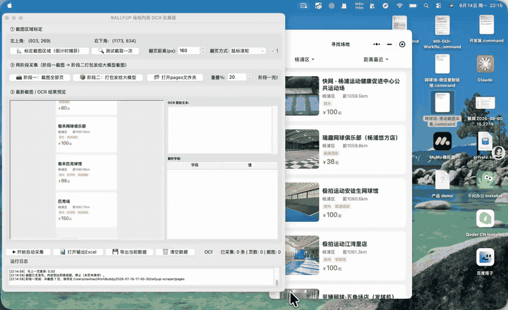
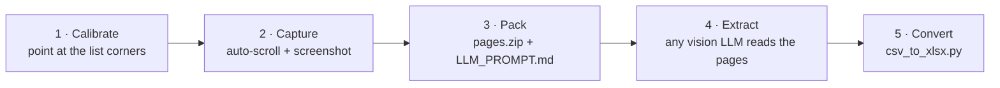

# Screen List Capturer

**Turn any on-screen list into a spreadsheet — without writing a scraper.**

[中文](./README.md)

---

Some lists are unreachable by code: a mini program, a native app, an Electron
client, a page behind a login. Reverse-engineering their APIs is slow and breaks
on every release. This tool goes the other way — it works on **pixels instead of
protocols**. Mark a region once, and it scrolls the list for you, screenshots
every screen, and packs them with a ready-to-paste prompt for a vision LLM.

You get a structured CSV out of a UI that has no API you can use.

```
list on screen  ->  pages/page_001.png ...  ->  pages.zip + LLM_PROMPT.md  ->  CSV  ->  .xlsx
```

**Who it is for:** anyone who needs a table out of an app they don't control —
product research, price collection, migrating your own data out of a tool that
won't let you export, building a test fixture that actually looks like production.

## Demo



Recorded on macOS against a list inside a mini program that offers no API (1:09).
What you see: region calibration → automatic scrolling and one screenshot per
screen → the tool detecting that the list has stopped moving and **stopping on
its own** instead of shooting the same bottom frame forever.

The last lines of the log are the interesting part:

```
wheel: asked 490pt, moved 0pt  -> treated as end of list
saved 7 pages -> page_007.png
```

> The GIF above is 720px / 8fps, so small UI text is blurry. For a
> pixel-readable original: [▶ full MP4 (7.7 MB)](https://github.com/m2290526022-boop/screen-list-capturer/blob/main/media/demo.mp4)

## How it works



1. **Calibrate** — a countdown walks you through the top-left and bottom-right
   corner of the list. Nothing else on screen matters.
2. **Capture** — the tool scrolls, waits for the list to settle, and saves one
   PNG per screen into `pages/`. It stops on its own when the list stops moving.
3. **Pack** — the screenshots are zipped and paired with `LLM_PROMPT.md`, a
   prompt that tells the model exactly which fields to pull and what not to
   invent. The prompt is also copied to your clipboard.
4. **Extract** — hand the zip and the prompt to any vision-capable LLM. It
   returns CSV.
5. **Convert** — `python csv_to_xlsx.py llm_output.csv` produces a formatted
   spreadsheet.

## Why not just scrape it?

| | DOM / API scraper | Screen List Capturer |
|---|---|---|
| Needs API or selectors | Yes | No |
| Breaks when UI changes | Often | No — it just screenshots |
| Setup time | Hours per target | ~1 min per target |
| Extraction accuracy | Exact | Depends on the vision model |
| Cost | Free | LLM tokens |

The trade-off is deliberate: you trade exactness for reach. Anything a human can
scroll through, this can capture.

## Install

```bash
git clone https://github.com/m2290526022-boop/screen-list-capturer.git
cd screen-list-capturer
pip install -r requirements.txt
python screen_list_capturer.py
```

Python 3.9+ is required. `tkinter` ships with most Python builds (see
`requirements.txt` if yours lacks it).

### macOS permissions

The tool drives the real mouse and reads the real screen, so grant your
terminal (or Python launcher):

- **System Settings → Privacy & Security → Accessibility**
- **System Settings → Privacy & Security → Screen Recording**

HiDPI / Retina displays need no setup: the capture box takes logical points (the
same units the mouse uses) and screenshots come back at 2x resolution.

### Windows / Linux

Works as-is. On Linux, `scrot` or `gnome-screenshot` may be needed for
`ImageGrab` to function.

## How it decides the list has ended

Every frame is compared with the previous one in grayscale, allowing a few
pixels of vertical offset so elastic-scroll bounce does not read as new content.
When the screen stops changing, capture stops immediately and the unchanged
frame is **not saved**. A near-identical frame (a bounce in flight) triggers one
extra settle-and-recheck before it is judged.

Measured separation on synthetic lists: jitter ≈ 0.0, a real new page ≈ 27
(mean per-pixel difference on a 64×64 downscale).

## How far one scroll really goes

`pyautogui.scroll()` takes wheel *units*, not pixels — and its own source warns
that values outside roughly ±10 per event have application-dependent results. A
single huge event gets merged into one gesture or truncated, so asking for a
large distance in one call simply does not work. Measured on a real mini
program: a request for half a screen moved the list by 52 px.

Instead the tool sends small bursts (≤10 units each), measures how far the page
actually moved from the screenshots, and tops up until the requested distance is
covered. Each page logs what it asked for and what it actually got:

```
  change vs previous page: 16.12
  wheel: asked 305pt, moved 298pt (59 units)
```

If a burst produces no movement at all, that is either the end of the list or an
app ignoring synthetic events — both are reported in the log.

## Configuration

| What | Where |
|---|---|
| Region, overlap %, scroll mode | In the app (top panel) |
| Extracted fields, prompt wording | `prompt_template.md` — edit freely, `{n_pages}` is substituted at pack time |
| Output location | `pages/`, `pages.zip`, `LLM_PROMPT.md` next to the script |

Overlap matters: a higher overlap produces more pages (more tokens) but loses
fewer rows that straddle a page boundary. 50% is a safe default.

`prompt_template.md` is the whole extraction contract — swap the field list for
your own use case and nothing else has to change.

## Troubleshooting

| Symptom | Cause |
|---|---|
| It scrolls once and stops at page 1 | Accessibility permission not granted, or the scroll mode does not suit the app — try the other one |
| Keeps screenshotting past the end | Only possible if the screen genuinely keeps changing (a spinner, a clock inside the region). Move the region to exclude it |
| Nothing is captured (black or wrong area) | Screen Recording permission, or the region changed size since calibration — recalibrate |
| Pages look duplicated | Overlap is too high, or a large scroll bounce at the very bottom kept one extra frame |

The capture loop can be simulated without a display, which is also the fastest
way to check a change to the stop logic:

```bash
python tests/test_capture_loop.py
```

## Limitations

Honest list of what this does *not* do:

- **No OCR, no local parsing.** Extraction quality is entirely the vision
  model's. Small text and dense layouts still trip it up.
- **No dedup across pages.** Overlap means the same item can appear on two
  pages; the prompt tells the model to list everything, so dedupe afterwards.
- **Fixed region.** If the list's position changes while scrolling (a sticky
  header that resizes, a banner that appears), recalibrate.
- **You must watch it once.** `pyautogui` FailSafe aborts if you throw the
  mouse into a screen corner — that is the intended escape hatch.

## Responsible use

This is a general-purpose screen capture utility. Use it on your own screens,
your own accounts, and data you are allowed to collect. Before capturing a
third-party app or website, check its terms of service and applicable law, and
do not use the output to build a competing dataset. The author is not
responsible for how it is used.

## License

[MIT](./LICENSE)
