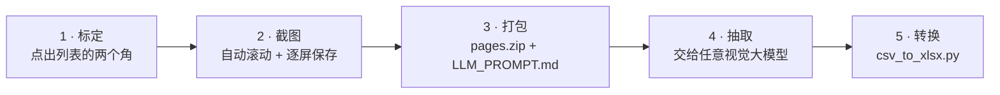

# Screen List Capturer

**把屏幕上任何列表变成表格 —— 不写一行爬虫。**

有些列表是代码够不着的：小程序、原生 App、Electron 客户端、登录之后才能看的页面。
去逆向它们的接口又慢又脆，对方一发版就废。

这个工具走的是另一条路：**只认像素，不认协议。**
框一次区域，它替你滚动、逐屏截图、打包，并生成一段可以直接粘给视觉大模型的提示词。

```
屏幕上的列表  ->  pages/page_001.png ...  ->  pages.zip + LLM_PROMPT.md  ->  CSV  ->  .xlsx
```

从一个没有接口的界面里，拿到一张结构化的表。

**适合谁用：** 需要从一个自己控制不了的 App 里掏出一张表的人 —— 竞品调研、价格采集、
把数据从不允许导出的工具里迁出来、造一份跟生产环境长得一样的测试夹具。

[English](./README.en.md)

---

## 演示

[▶ 看演示视频（1 分 09 秒，MP4，7.7 MB）](https://github.com/m2290526022-boop/screen-list-capturer/blob/main/media/demo.mp4)

在 macOS 上对着一个没有接口的小程序列表实录。画面里能看到：标定区域 → 自动滚动、
逐屏截图 → 工具判断列表已经不再移动，**自己停下来**，而不是对着底部那一帧一直拍。

日志最后两行是关键：

```
滚轮请求 490px / 实滚 0px（一直无位移）  -> 视为已到达列表末端
已保存 7 页 -> page_007.png
```

---

## 工作原理



1. **标定** —— 倒计时引导你点出列表的左上角和右下角。屏幕上其他东西都不影响。
2. **截图** —— 工具滚动、等列表稳定，然后每屏存一张 PNG 到 `pages/`。列表不再变化时自动停止。
3. **打包** —— 截图打包成 zip，同时生成 `LLM_PROMPT.md`：告诉模型该抽哪些字段、什么不许编。
   提示词会一并复制到剪贴板。
4. **抽取** —— 把 zip 和提示词交给任意支持视觉的模型，它返回 CSV。
5. **转换** —— `python csv_to_xlsx.py llm_output.csv` 生成排版好的表格文件。

## 为什么不直接爬？

| | DOM / 接口爬虫 | Screen List Capturer |
|---|---|---|
| 需要接口或选择器 | 是 | 否 |
| 界面改版就挂 | 经常 | 不会 —— 它只是截图 |
| 单个目标接入成本 | 数小时 | 约 1 分钟 |
| 抽取准确度 | 精确 | 取决于视觉模型 |
| 成本 | 免费 | 消耗 token |

取舍是明确的：拿「精确度」换「可达性」。人能滚着看完的列表，它就能采下来。

## 安装

```bash
git clone https://github.com/m2290526022-boop/screen-list-capturer.git
cd screen-list-capturer
pip install -r requirements.txt
python screen_list_capturer.py
```

需要 Python 3.9+。`tkinter` 一般随 Python 自带（若缺失见 `requirements.txt` 注释）。

### macOS 权限

工具要驱动真实鼠标、读取真实屏幕，所以需要给终端（或你用的 Python 启动器）授权：

- **系统设置 → 隐私与安全性 → 辅助功能**
- **系统设置 → 隐私与安全性 → 屏幕录制**

Retina / HiDPI 屏无需任何设置：截图区域用逻辑点（和鼠标坐标同一套单位），
截图本身会以 2 倍分辨率返回。

### Windows / Linux

开箱可用。Linux 下 `ImageGrab` 可能需要 `scrot` 或 `gnome-screenshot`。

## 它怎么判断列表到底了

每一帧都和上一帧做灰度比对，并允许几个像素的纵向位移 —— 这样弹性滚动的回弹
不会被当成新内容。画面不再变化就立刻停止，**这一帧不会保存**。
如果遇到「几乎一样」的帧（说明回弹还在路上），会多等一次再判断。

合成数据上测出来的区分度：抖动 ≈ 0.0，真实翻一页 ≈ 27（64×64 降采样后的平均像素差）。

## 滚轮一次到底能滚多远

`pyautogui.scroll()` 的单位是**滚轮格数**不是像素，它自己的源码注释就警告：
单次事件超过 ±10 结果取决于应用 —— 一次发一个巨大事件会被合并成单次手势或直接截断，
这就是为什么你把 PX 调多大都没用。实测：请求滚半屏，实际只动了 52px。

所以工具改成小批量发送（每批 ≤10 格），每批结束用截图测出真实位移，不够就补发，
直到达到目标距离。每页日志都会打印「请求多少 / 实际滚了多少」：

```
与上一页差异: 16.12
滚轮请求 305px / 实滚 298px
```

如果某一批完全没有位移，那要么是列表到底了，要么是应用忽略了合成事件 ——
两种情况都会在日志里明确写出来。

## 配置项

| 想改什么 | 去哪改 |
|---|---|
| 区域、重叠百分比、翻页方式 | 工具界面顶部 |
| 抽取字段、提示词措辞 | `prompt_template.md`，随便改，打包时只替换 `{n_pages}` |
| 产物位置 | 脚本同级的 `pages/`、`pages.zip`、`LLM_PROMPT.md` |

重叠率很关键：重叠越大页数越多（token 越贵），但跨页被截断的条目越少。默认 50% 比较稳。

`prompt_template.md` 就是全部的抽取契约 —— 把字段列表换成你自己的场景，其他什么都不用改。

## 排查

| 现象 | 原因 |
|---|---|
| 滚一次就停在第 1 页 | 辅助功能权限没给，或者当前翻页方式不适合这个应用 —— 换另一种试试 |
| 到底了还在不停截图 | 只有在画面确实还在变时才会发生（区域里有个转圈动画、时钟）。把区域挪开避开它 |
| 什么都没截到（全黑或区域不对） | 屏幕录制权限没给，或者标定后区域尺寸变了 —— 重新标定 |
| 页面看着重复 | 重叠率太高，或者到底时回弹幅度大导致多留了一帧 |

采集循环可以不开图形界面直接模拟，这也是验证停止逻辑改动最快的方式：

```bash
python tests/test_capture_loop.py
```

## 已知局限

先把话说清楚，它**不**做这些事：

- **不做本地 OCR、不做本地解析。** 抽取质量完全取决于视觉模型，小字和密集版式仍会出错。
- **不跨页去重。** 有重叠就意味着同一条目可能出现在两页，提示词要求模型「看到什么列什么」，
  去重请在事后做。滚到底时若回弹幅度很大，可能会多留一帧重复页 —— 这是有意为之：
  漏采比多采一张更糟。
- **区域是固定的。** 如果滚动过程中列表位置发生变化（比如吸顶栏高度变化、突然出现横幅），
  需要重新标定。
- **人得看一眼。** `pyautogui` 的 FailSafe 在鼠标甩到屏幕角落时会中止 —— 这是有意留的紧急出口。

## 使用声明

这是一个通用屏幕截图工具。请只用于你自己的屏幕、自己的账号、以及你有权采集的数据。
采集第三方 App 或网站前，请先确认其服务条款与适用法律，不要用产出去构建竞品数据集。
作者不对使用方式负责。

## License

[MIT](./LICENSE)
